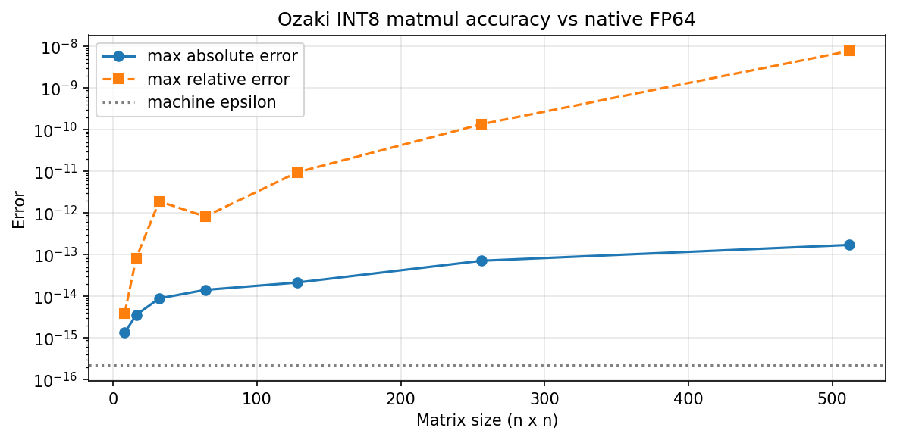
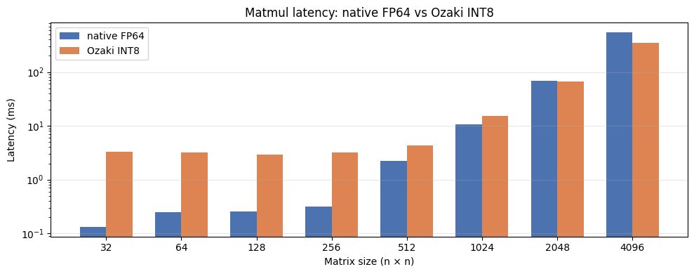
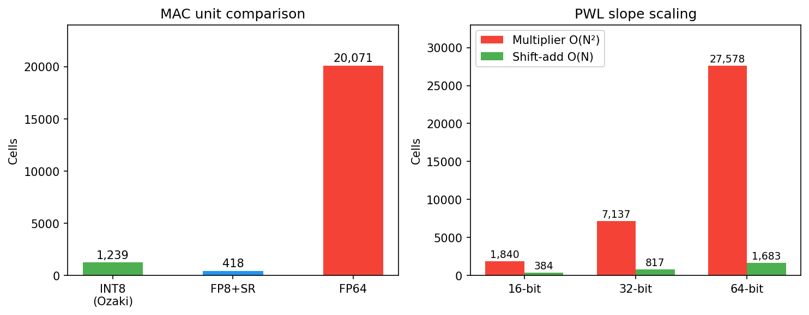
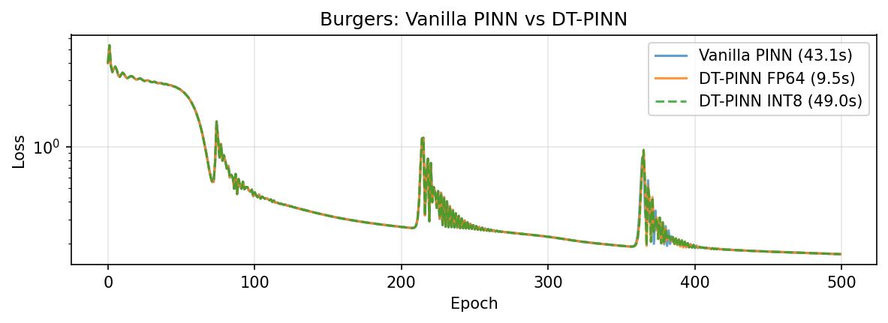
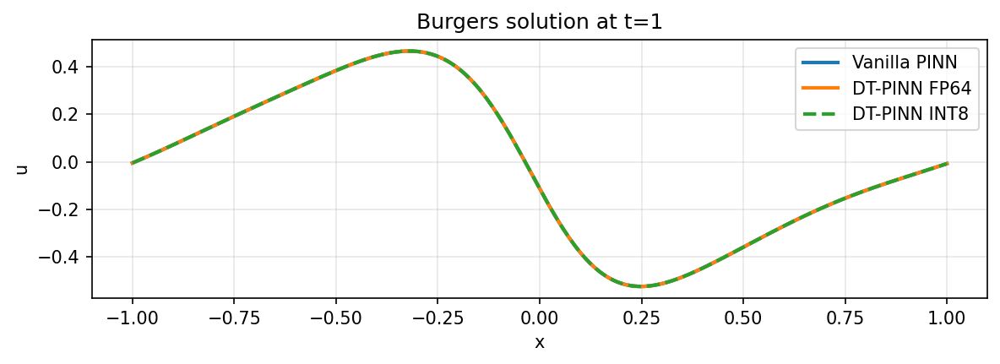

# fp-emulation

FP64-exact results from INT8 integer ops.

## Problem

PDE solvers often use FP64. FP32 breaks because higher-order derivatives amplify rounding error. But FP64 is expensive: 1/32 throughput on consumer GPUs, large and power-hungry units.

## Approach

- **Matmul**: [Ozaki scheme II](https://arxiv.org/abs/2504.08009). Split floats to integers, do several INT8 matmuls (one per small prime modulus), reconstruct via Chinese Remainder Theorem. FP64-exact.
- **Activations**: [ML-PLAC](https://www.mdpi.com/2076-3417/12/20/10616). Piecewise-linear via bit-shifts and adds only. No multiplier. O(N) area vs O(N²).

<figure>

<figcaption>Ozaki vs <code>torch.matmul</code>. Max absolute error stays within O(n * eps). Relative error grows for near-zero entries (small denominator, not precision problem).</figcaption>
</figure>

## GPU benchmarks

On GPUs, Ozaki is slower at small n because each matmul becomes several kernel launches (one per modulus) plus Python overhead. At large n, INT8 throughput wins. T4 has 130 TOPS INT8 vs 0.25 TFLOPS FP64.

<figure>

<figcaption>T4 GPU. Fixed Ozaki overhead shrinks relative to compute as n grows.</figcaption>
</figure>

## Hardware target

The real point: dedicated fixed-point silicon.

- INT8 MAC is 16x smaller than FP64. Same die area -> 16x more compute.
- The per-modulus matmuls pipeline in hardware. No kernel launches.
- ML-PLAC slopes use only bit-shifts. 16x smaller than multipliers at 64-bit.

<figure>

<figcaption>
Yosys gate-level cell counts (<code>hw/synth/</code>).
<b>Left:</b> MAC unit comparison. FP8 + stochastic rounding (418 cells) is 3x smaller than INT8 Ozaki (1,239) and 48x smaller than FP64 (20,071).
<b>Right:</b> ML-PLAC shifts vs multiplier, gap widens with width.
</figcaption>
</figure>

RTL in `hw/rtl/`, testbenches in `hw/sim/`, synthesis in `hw/synth/`.

## DT-PINNs

[DT-PINNs](https://arxiv.org/abs/2205.09332) replace autodiff with numerical differentiation matrices (paper uses RBF-FD). We use [Chebyshev spectral](https://people.maths.ox.ac.uk/trefethen/spectral.html) differentiation instead. Dense matmuls, ideal for INT8 Ozaki.

<figure>

<figcaption>Burgers' equation. INT8 Ozaki and FP64 loss curves overlap.</figcaption>
</figure>

<figure>

<figcaption>Solution at t=1. All three methods match. INT8 indistinguishable from FP64.</figcaption>
</figure>

## Try it

```python
from fp_emulation import ozaki2_int8_matmul, convert

C = ozaki2_int8_matmul(A, B)   # FP64-exact via INT8 tensor cores
model = convert(model)         # swap all nn.Linear layers
```

[`notebooks/04_demo.ipynb`](notebooks/04_demo.ipynb) — accuracy, benchmarks, Burgers PINN
[`notebooks/05_dt_pinn.ipynb`](notebooks/05_dt_pinn.ipynb) — DT-PINN with INT8 Ozaki

Run on Colab with T4 GPU:
1. Fork -> Open in Colab -> Set runtime to T4

## References

- [Ozaki scheme II](https://arxiv.org/abs/2504.08009)
- [Ozaki error-free transformations](https://dl.acm.org/doi/epdf/10.1145/3731599.3767539)
- [TwoProduct/TwoSum](https://doi.org/10.1137/030601818)
- [ML-PLAC](https://www.mdpi.com/2076-3417/12/20/10616)
- [DT-PINNs](https://arxiv.org/abs/2205.09332)
- [Chebyshev spectral methods](https://people.maths.ox.ac.uk/trefethen/spectral.html)
- [Lazy stochastic rounding FP MAC](https://arxiv.org/abs/2404.14010)
- [What Every CS Should Know About FP](https://docs.oracle.com/cd/E19957-01/806-3568/ncg_goldberg.html)
