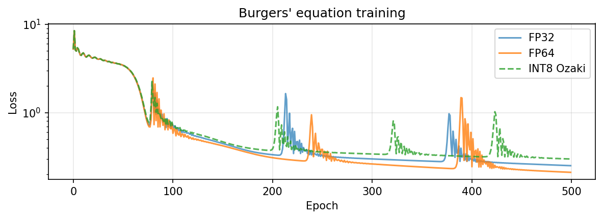
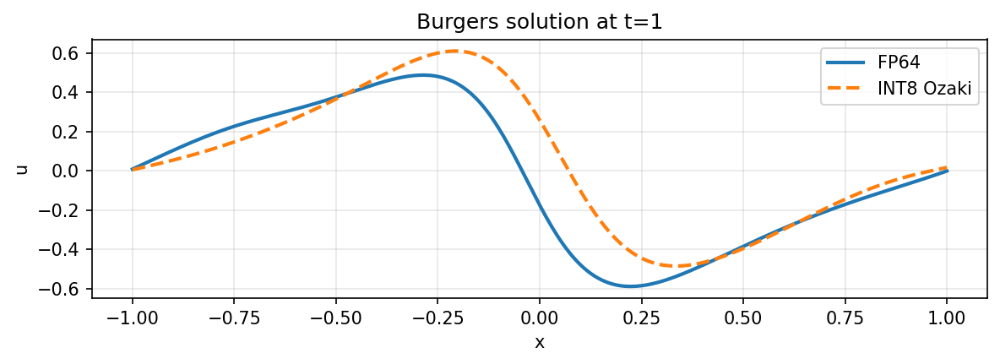

# fp-emulation

FP64-exact matmul and activations from INT8 integer ops.

```python
from fp_emulation import ozaki2_int8_matmul, convert

C = ozaki2_int8_matmul(A, B)   # FP64-exact via INT8 tensor cores
model = convert(model)         # swap all nn.Linear layers
```

## Problem

PDE solvers need FP64. Higher-order derivatives amplify rounding error through the chain rule. FP32 breaks.

FP64 is expensive:
- 1/32 throughput on consumer GPUs (RTX 3090, T4)
- Even datacenter GPUs dedicate most die to FP32/FP16/INT8
- FP64 units are large and power-hungry

## Solution

INT8 integer ops, FP64-exact results.

- **Matmul**: [Ozaki scheme II](https://arxiv.org/abs/2504.08009) splits floats into integers, does L modular matmuls, reconstructs via Chinese Remainder Theorem (CRT). Exact to FP64!
- **Activations**: [ML-PLAC](https://www.mdpi.com/2076-3417/12/20/10616) approximates any nonlinear function with piecewise-linear segments using only bit-shifts and adds at a chosen/arbitrary precision and accuracy. No multiplier, perfect for arbitrary precision deep learning.

Works on any GPU with INT8 tensor cores, but only better than native on old GPUs. Autodiff via `torch.autograd`. The real benefit is for our hardware, see why in next section.

<figure>

<figcaption>INT8 Ozaki max absolute error stays near machine epsilon. Relative error grows for near-zero entries (small denominator).</figcaption>
</figure>

<figure>


<figcaption>Burgers' equation PINN. Chaotic training dynamics mean different precision -> different local minima. See DT-PINN below for clean comparison.</figcaption>
</figure>

## Fixed-point acceleration

On SOTA GPUs, Ozaki fp emulation is slower than native FP64 (L kernel launches, Python overhead). The real target is dedicated fixed-point silicon!

Replace FP64 hardware with INT8:
- INT8 MAC is 16x smaller. Same die area -> 16x more compute.
- L matmuls pipeline in hardware. No kernel launches.
- ML-PLAC slope cores (for piecewise linear activations) avoid multipliers and solely use bit-shifts. This scales O(N) vs multiplier O(N²). 16x smaller at 64-bit!

<figure>

<figcaption>
Yosys gate-level cell counts (<code>hw/synth/</code>).
<b>Left:</b> INT8 vs FP64 MAC. Same precision, 16x less silicon. Awesome for us!
<b>Right:</b> ML-PLAC bit-shifts vs multiplier. Gap widens with data width.
</figcaption>
</figure>

RTL in `hw/rtl/`, testbenches in `hw/sim/`.

## DT-PINNs

[DT-PINNs](https://arxiv.org/abs/2205.09332) replace autodiff with numerical differentiation matrices ([Chebyshev spectral](https://people.maths.ox.ac.uk/trefethen/spectral.html)). Compute becomes matmul-dominated, accelerated with INT8 tensor cores.

[`notebooks/05_dt_pinn.ipynb`](notebooks/05_dt_pinn.ipynb)

<figure>


<figcaption>Burgers' equation: vanilla PINN (autograd) vs DT-PINN (matmul derivatives). INT8 Ozaki maintains FP64 precision.</figcaption>
</figure>

## Try it

[`notebooks/04_demo.ipynb`](notebooks/04_demo.ipynb) - accuracy, benchmarks, Burgers PINN<br>
[`notebooks/05_dt_pinn.ipynb`](notebooks/05_dt_pinn.ipynb) - DT-PINN with Ozaki INT8

Run free on Colab with T4 GPU (fast INT8, slower FP64):
1. Fork this repo
2. Open in Colab (File -> Open notebook -> GitHub -> your personal fork)
3. Set runtime to T4 (Runtime -> Change runtime type -> T4)

## References

- [Ozaki II scheme for matmul](https://arxiv.org/abs/2504.08009)
- [Ozaki error-free transformations](https://dl.acm.org/doi/epdf/10.1145/3731599.3767539)
- [TwoProduct/TwoSum](https://doi.org/10.1137/030601818)
- [ML-PLAC bit-shift piecewise linear](https://www.mdpi.com/2076-3417/12/20/10616)
- [DT-PINNs](https://arxiv.org/abs/2205.09332)
- [What Every CS Should Know About FP Arithmetic](https://docs.oracle.com/cd/E19957-01/806-3568/ncg_goldberg.html)
